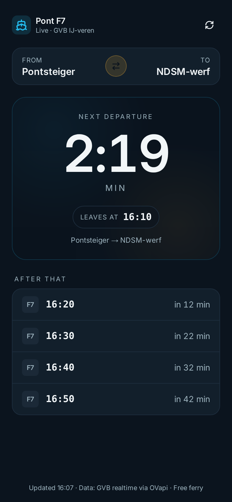

# Pont — Pontsteiger ↔ NDSM

A tiny mobile-friendly web app that shows a live countdown to the next GVB F7 ferry between **Pontsteiger** and **NDSM-werf** in Amsterdam.

Data comes from the public OVapi realtime feed (GVB), so it includes actual delays — not just the static timetable.



## Features

- Big countdown to the next ferry (updates every second)
- Tap the From/To card to swap direction
- "After that" list with the next 4 scheduled departures
- Auto-refreshes live data every 30 seconds
- Dark mode follows your phone settings
- Timezone-safe (always renders Europe/Amsterdam time)

## Tech

- React + Vite + Tailwind CSS (frontend)
- Express (backend, proxies [OVapi](http://v0.ovapi.nl) to work around CORS/HTTPS)
- Single Node process, runs on any container host

## Run locally

```bash
npm install
npm run dev
```

Then open http://localhost:5000.

## Build and run in production

```bash
npm run build
npm start
```

## Deploy

[](https://render.com/deploy?repo=https://github.com/bootsandcats/ferry-pont)

Click the button, sign in with GitHub, approve the blueprint. Live at `https://ferry-pont.onrender.com`.

## Data source

- Line: **F7** (Pontsteiger ↔ NDSM-werf), GVB Amsterdam
- Feed: `http://v0.ovapi.nl/tpc/<timingpointcode>`
- Timing points used: `30009900` (Pontsteiger), `30009902` (NDSM-werf)

The free ferry runs ~06:40–23:40 on weekdays and 09:00–23:40 on weekends. Outside those hours the app shows "No more boats".

## License

MIT
